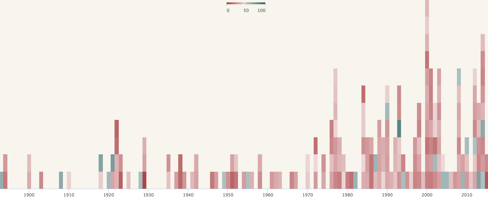

# Interactive heatmap-barchart with R/highcharts


## Introduction

This document describes the procedure to create an interactive a heatmap-barchart ("heatbar"?) from R. You can a see screenshot under. The interactive examples of such graphic can be seen here:



This chart is fully created in R, leveraging [highcharts](http://www.highcharts.com) (a javascript charting library). It takes only about a dozen lines of R code to create such interactive chart.

If you are already proficient with javascript, such as with [d3](http://d3js.org) or [Highcharts](http://www.highcharts.com) (not my case), there is probably not much to gain for you from this tutorial. But if you mainly know R and wishes to create such an interactive chart, please read on :-)

## About the graphic type
The live example shows all Swiss people's initiatives, each square being a ballot coloured based on the % of yes votes. On one hand, it is a bar/column chart showing the number of ballots over the years. On the other hand, it is a heatmap with each vote being coloured according to the % of yes. The interactivity with a tooltip showing the title of each ballot is a nice explorative feature.

Technically, this graphic is a heatmap coerced into a column chart. One could achieve something similar with an interactive dot chart.

## Create the chart

### Getting started

You will need to have installed the R package [rCharts](http://rcharts.io), a wonderful wrapper for numerous javascript charting libraries. For that, you need devtools installed. In R:

```
install.packages("devtools")
require(devtools)
install_github('rCharts', 'ramnathv')
library(rCharts)

# Load the data file
data <- read.csv("citizenInitiatives_ch.csv", stringsAsFactors = F)
```

### Reshape the data

The data file contains 3 columns: the date, the % of yes and the title of the vote. To create a heatmap we will aggregate all the votes by year (x dimension) and count the number of votes each year (y dimension).


```
# Get only the year from each date (not an elegant solution here, better to use date)
data$year <- as.numeric(substr(data$date,1, 4))

# add the count of the observations (initiatives) per year. The count starts at 0 each year
data <- do.call(rbind, by(data, data$year, function(dd) cbind(dd, n = as.numeric(0:(nrow(dd)-1)))))
rownames(data) <- NULL
```

One can usually easily create an interactive chart with a oneliner in rCharts.
However to create a heatmap, the procedure is slightly more complicated since the current version of rCharts 0.4.5 does not include the heatmap extensions yet.

The extra steps for a heatmap involve having some required colnames and converting the data frame to JSON.

```
# change the names of the data.frame to be highcharts-friendly
colnames(data) <- c('date', 'name', 'value', 'x', 'y')
```


### Plot the heatmap

```
# Create a new highchart instance
a <- Highcharts$new()
a$chart(zoomType = "x", type = 'heatmap', width = 1000)
# Pass the data as JSON (workaround with rCharts 0.4.5 not supporting heatmap natively)
a$series(name = "", data =  rCharts::toJSONArray2(data, json = F, names = T))
```

We need then to define the heatmap colour scale. Because the values used for the heatmap are percentages, I set the scale to range from 0 to 100. The list 'stops' contain the colours to use for the different breaks, reds for values less than 50%, greens for 50% onwards.
```
a$addParams(colorAxis = list(min = 0, max = 100, stops = list(list(0, '#ab3d3f'),
	list(0.499, '#EED8D9'),list(0.5, '#ADC2C2'),list(1, '#336666'))))
```

Some aesthetic tweaks to get rid of y axis' grid lines, ticks and labels
```
a$yAxis(lineWidth = 0, minorGridLineWidth = 0, lineColor = 'transparent', title = list(text = ""),
	labels = list(enabled = FALSE), minorTickLength = 0, tickLength =  0, gridLineWidth =  0, minorGridLineWidth = 0)
```

One finally needs to the heatmap javaScript library currently not in rCharts
```
a$addAssets(js = c("https://code.highcharts.com/modules/heatmap.js"))
```

And we are done. We can preview the heatmap-barchart in a browser, by simply calling our chart in R:
```
a
```

### Customise the tooltip
At this point, you might notice that the tooltip shows the series name, the x and y values. This is not really helpful because we only have one serie here and we wish to have the vote name displayed instead. We can customise the tooltip by defining a formatter callback, returning HTML.

```
formatter <- "#! function() { return '<div class=\"tooltip\" style=\"color:#686868;font-size:0.8em\">In <b>' +
	this.point.x + ',</b> the initiative:<br><br><i>' + this.point.name + '<br><br></i>gathered <b>' + this.point.value + '%</b> yes</div>'; } !#"
a$tooltip(formatter = formatter, useHTML = T, borderWidth = 2, backgroundColor = 'rgba(255,255,255,0.8)')
a
```

## Remarks
Highcharts offers heaps of options. Check its documentation if you wish to do more: http://api.highcharts.com/highcharts

A legal note about Highcharts, it is open-source but free only for non-commercial usage. Please refer to its [licence](http://www.highcharts.com/products/highcharts/#non-commercia) for commercial usage.


## Credits
* The workaround to create an Highcharts heatmap in R comes from [Stefan Wilhelm](http://stefan-wilhelm.net/interactive-highcharts-heat-maps-in-r-with-rcharts/)
* The awesome [rCharts](http://rcharts.io) by [Ramnath Vaidyanathan](https://github.com/ramnathv)
* [Highcharts](http://www.highcharts.com)


